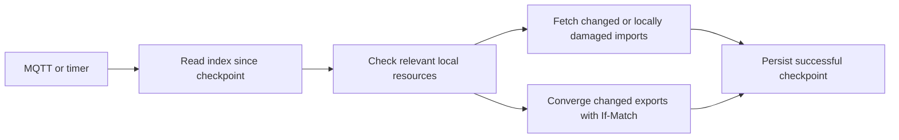

# Agent synchronization with a checkpoint

## Outcome and scope

An unchanged controller pass makes one authenticated sync request per ready
consumer, rather than one configuration request plus a read for every import
and export. MQTT wakes synchronization; the ten-minute timer repairs missed
hints through the same endpoint. Payloads remain behind the existing mTLS,
UID-bound grant, and current ACL checks. Local source and target drift still
converges without waiting for a remote change.

Implement in an isolated worktree, on top of the Kubernetes watch resume fix.
Keep the existing `/v1/changes` snapshot contract for older consumers. Do not
implement the administrator CLI, deploy, apply a production migration, or merge.

## Existing behavior

- `listAgentChanges()` is available but unused by the controller.
- `/v1/changes` walks a current access snapshot with fifteen-minute pagination
  state. It is not a changes-since checkpoint and hydrates individual heads.
- A full controller pass reads configuration and every import/export remotely.
- MQTT and Kubernetes events schedule that full pass. The watch resume fix
  already prevents replaying an entire collection on ordinary reconnects.
- Secret publication is already one DynamoDB transaction: current head,
  revision workflow, ACL changes, idempotency state, and notification outbox.
- Heads identify immutable secret UIDs. Archiving releases the public name;
  an old UID must never become access to its replacement.

## Storage and publication

Use the existing control table's primary key, with strongly consistent reads.
Do not add a GSI or asynchronously derive the authoritative sync projection
from streams. DynamoDB transactions provide atomic publication; a GSI cannot
provide the same checkpoint guarantee because index propagation is eventual.

| Key                                            | Contents                                                                                         | Lifetime                                            |
| ---------------------------------------------- | ------------------------------------------------------------------------------------------------ | --------------------------------------------------- |
| `AGENT_SYNC#environment / STATE`               | Epoch, committed sequence, readiness                                                             | Environment lifetime                                |
| `AGENT_SYNC#environment / CHANGE#sequence#uid` | Latest UID, public ID, control/payload versions, state, safe metadata, current read consumer IDs | Current secret; archived marker retained eight days |
| Existing secret `HEAD`                         | Latest sync sequence                                                                             | Secret lifetime                                     |
| Existing `CURSOR#token / STATE`                | Caller/scope-bound page or checkpoint state                                                      | Page: fifteen minutes; checkpoint: seven days       |

There is one index entry per current secret, not one retained event per write
or a replicated entry for every consumer. A secret update removes its previous
sequence key and writes its new key in the publication transaction. Internal
read consumer IDs enforce ACL filtering and are never returned to callers.
Archived markers use TTL; active entries do not. Repeated updates coalesce.

Capture the current environment sequence, then the current head's projection
sequence. Add a conditional counter advance, the new projection, deletion of
the old projection, and the head's new sequence to the existing transaction.
Retry bounded counter contention; do not reinterpret failed lease conditions
or authorization checks as successful writes. Stay below the existing
100-action and 4 MB transaction limits, including the maximum ACL replacement.
The environment counter is an intentional serialization point for writes;
reads scale independently. This fits the observed low write rate.

### Checkpoint correctness

Sequence numbers are committed with the state they represent, never reserved
before publication. If a response captures sequence `H`, a later successful
publication must have sequence greater than `H`.

Each sync queries keys greater than its prior checkpoint and no greater than
`H`. Its page cursor preserves that range. If a concurrent update moves an
unread entry beyond `H`, the next sync observes the newer entry. A deleted old
pagination key remains a valid exclusive start position. The API promises
eventual convergence to current state, not replay of intermediate revisions
or a frozen multi-page snapshot. An absent bootstrap entry is not proof of
revocation: a concurrent write may have moved it beyond the captured range.
Use an authoritative read for that exceptional missing-entry case.

## API and typed client

Add `GET /v1/agent/sync`, restricted to an active AgentGrant. Both read and
write-only grants can synchronize. An empty active grant can still synchronize
to remove local mirrors after scope removal.

| Query        | Meaning                                     |
| ------------ | ------------------------------------------- |
| None         | Initial current-state snapshot              |
| `syncCursor` | Changes after a completed checkpoint        |
| `cursor`     | Continue the bounded range in a page cursor |

The two cursor query parameters are mutually exclusive. Return current safe
agent configuration, `snapshot`, scoped `changes`, and exactly one continuation:
`nextCursor` while pages remain, or `syncCursor` on the final page. An unchanged
checkpoint returns no changes and reuses the token, avoiding routine cursor
writes. Renew through a fresh snapshot when it expires.

Entries expose UID, public ID, versions, effective permissions, and state.
Return organizational metadata only for write permission, as the existing
export control route does. Read permission also requires the current indexed
ACL; grant membership alone is insufficient. Outside-scope index records are
filtered before serialization. Archived/read-revoked entries contain no
payload version or organizational metadata unless independently authorized
write access remains. Grant configuration is always authoritative per request.

Bind tokens to environment, consumer, epoch, and a canonical digest of the
current grant's UID/name/permission pairs and capabilities. Malformed or
cross-caller tokens fail without exposing their contents. Expired checkpoints,
scope changes, or a replaced index epoch produce `410 sync_reset_required`.
Incomplete/backfilled indexes produce `503 sync_index_not_ready`.

Keep the contract in OpenAPI, backend-owned domain types, and `@zyno-io/hemlig-client`.
The consumer API already routes through its default Lambda integration.
Sync remains audited under the existing handler policy; do not change audit
retention or tracing as part of this work.

## Controller



Replace `getAgentConfig()` in consumer reconciliation with paginated sync.
Use the returned configuration for MQTT and cross-resource grant checks.
Store the completed checkpoint and a non-secret identity/API fingerprint in
the HemligConsumer status. A changed identity or API endpoint starts a fresh
snapshot. Existing CRD status preserves additional fields; no new RBAC or
cluster storage resource is necessary.

For imports, compare the indexed control version with the verified target's
annotations and data checksum. Skip remote reads when both agree. A changed
version, missing/tampered target, new resource, or uncertain snapshot entry
uses the existing authoritative conditional payload route. Explicit read
revocation or removal from grant scope removes only the owned target, using
the current revocation behavior regardless of ordinary deletion policy.

For exports, compare local source checksum, resource generation, and indexed
versions. Skip unchanged exports. Use indexed write-authorized metadata and
control versions for mutations; obtain authoritative control for new resources
or missing bootstrap entries. Preserve current Idempotency-Key generation and
If-Match behavior. A conflict retries synchronization; it never silently
overwrites a concurrent writer.

Only persist the new consumer checkpoint after its referenced resources have
converged. A failed application or status write leaves the prior checkpoint
intact. Retried pages and repeated hints are safe because target application
and export mutations retain their existing ownership/idempotency checks.
Durable per-resource statuses supply unchanged versions after a controller
restart; a new resource or unverified local state gets an authoritative read.

Filter Secret and Namespace watch activity to resources/namespaces currently
referenced by Hemlig. Keep periodic local checks, ownership checks, and retry
backoff. Do not introduce a second complex work queue in this change: a local
metadata pass is acceptable once unchanged resources stop making remote reads.

## Backfill and rollout preparation

New environment creation initializes a ready empty index in the same
transaction. Existing environments need an explicit backfill before use.
Add a dry-run-by-default operator using table head/control metadata only.
During apply it rereads each current head and uses revision-guarded publication,
so a concurrent secret mutation cannot be overwritten. A full successful scan
marks the environment ready; failure leaves it unavailable for sync. Existing
secret writers publish projections even before readiness. No secret payload,
token, key, certificate, or ACL content appears in operator output.

Rollout order, documented but not executed: publish server support; run and
verify backfill; publish the client/controller; then monitor request rates and
convergence. Older controllers remain compatible. A new controller against an
older/unprepared backend fails visibly and backs off, rather than falling back
to the expensive full polling behavior.

Before backfill, confirm every writer runs the new publication code and let
invocations using the previous server version drain. A writer running the old
code cannot maintain the index. Resolve legacy UID/environment migration
failures before marking the index ready.

The following commands are rollout instructions; neither has been executed
against production:

```sh
# Explicit AWS profile/region and the existing control table, supplied by operator.
AWS_PROFILE=<profile> AWS_REGION=<region> CONTROL_TABLE_NAME=<table> yarn backfill:agent-sync
# Only after reviewing the dry-run counts and confirming all writers are upgraded.
AWS_PROFILE=<profile> AWS_REGION=<region> CONTROL_TABLE_NAME=<table> yarn backfill:agent-sync --apply
```

Verify an initial sync, an unchanged checkpoint, a changed secret, ACL removal,
and archive/name reuse in the chosen environment before upgrading controllers.
Compare API request counts and per-route rates with the prior six-day baseline;
check sync errors and convergence before broadening the rollout. To roll back
the controller, the previous version can use its existing routes. Do not roll
back server publication while cursor-based controllers are active: that would
leave apparently valid checkpoints missing subsequent changes.

## Double-check and validation

- [x] Existing mTLS, UID grants, ACL checks, archive/name reuse, CRD status,
      transaction action budget, and API routing inspected.
- [x] Concurrency proof checked against DynamoDB's documented transaction and
      strongly consistent query behavior; coalescing promises convergence rather
      than event history.
- [x] Exercise atomic publication, coalescing, sequence contention, failed
      transaction, bounded retention, and maximum ACL replacement.
- [x] Exercise cursor scope/expiry/epoch, pagination, unchanged-token reuse,
      read revocation, write-only grants, empty grants, and safe serialization.
- [x] Exercise concurrent movement beyond a page frontier and initial-sync
      missing entries; verify subsequent synchronization catches them.
- [x] Exercise restart, damaged/missing target, unrelated local events, grant
      removal, archive/name reuse, export drift, If-Match conflicts, and failed
      status/application preventing checkpoint advancement.
- [x] Assert unchanged multi-resource reconciliation makes one sync request
      and zero payload/control/config reads; a change fetches only affected data.
- [x] Build/lint relevant packages, run focused and repository checks, and
      validate OpenAPI/Markdown without visual tooling.
- [ ] Run standard PR CI, including actual DynamoDB expressions in MiniStack,
      the controller container build, and Helm validation, before any merge.

References: [DynamoDB transactions](https://docs.aws.amazon.com/amazondynamodb/latest/developerguide/transaction-apis.html),
[Query](https://docs.aws.amazon.com/amazondynamodb/latest/APIReference/API_Query.html),
[GSI propagation](https://docs.aws.amazon.com/amazondynamodb/latest/developerguide/GSI.html).
