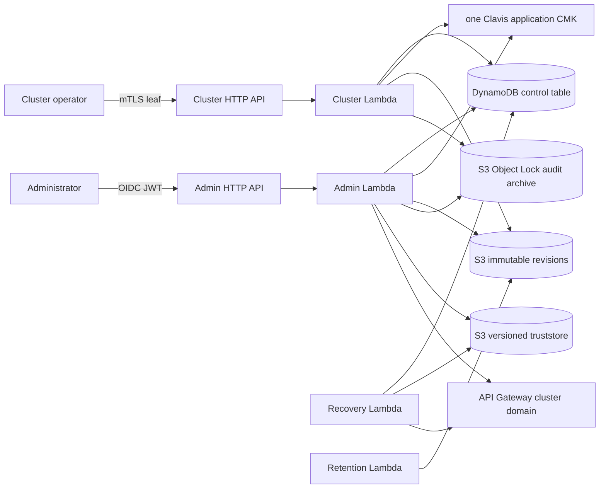

# Clavis architecture

Clavis delivers Kubernetes Secret payloads to non-AWS clusters without giving
those clusters AWS credentials. Administrators define encrypted secrets and
cluster read ACLs; enrolled clusters receive only the payloads they may read.

This document describes the v0.2 implementation. It includes organizational
metadata/catalog browsing and the enrollment/truststore workflow. Issuer-root
rotation and audit query remain intentionally excluded. See
[API reference](api.md) for the HTTP contract and
[deployment guide](cdk-integration.md) for installation inputs.

## Goals

- Keep plaintext values out of DynamoDB, audit records, logs, and S3 revisions.
- Give clusters no AWS principal or AWS credential.
- Make secret revisions immutable and mutations optimistic and idempotent.
- Keep application evidence in a distinct S3 Object Lock archive.
- Change metadata or ACLs without decrypting an existing payload.
- Provision an installation from CDK with `clv-<environment>-` resource names.

## System overview



The CDK stack binds an organization-owned OIDC issuer/audience, creates custom
domains, Route 53 aliases, a versioned truststore bucket, one-year sanitized
API Gateway access-log groups, and EventBridge schedules. Access logs record
only request ID, status, and gateway/authorizer error fields—never headers,
query strings, or request bodies. The cluster domain starts without a
truststore. Enrollment publishes a unique PEM bundle, pins its returned S3
version on that domain, verifies an observed `AVAILABLE` domain state without
truststore warnings, and only then activates the leaf identity. The cluster
handler also rejects a request without both a client certificate and active
identity row.

## Authentication and trust boundaries

| Caller           | Authentication                                                         | Rights                                                      |
| ---------------- | ---------------------------------------------------------------------- | ----------------------------------------------------------- |
| Administrator    | External OIDC JWT, immutable configured actor claim (`sub` by default) | Secret mutation                                             |
| Cluster operator | Client certificate DER SHA-256 fingerprint in DynamoDB                 | Its allowed active secret reads and current access snapshot |
| Worker           | EventBridge/Lambda execution role                                      | Recovery or retention only                                  |

API Gateway verifies the administrator JWT, and the handler verifies its issuer
and audience again before using the configured subject claim for the audit
actor. The CDK stack receives the issuer/audience from the installer. The
handler accepts `client_id` only when `aud` is absent, matching API Gateway's
JWT-authorizer claim precedence.

For a cluster, API Gateway supplies the peer PEM in the HTTP API request
context. Clavis parses it, SHA-256 hashes the raw DER bytes, and makes a
strongly consistent lookup of `IDENTITY#<fingerprint> / PROFILE`. It requires
an `ACTIVE` API identity within its validity window and carries its enrolled
environment into every authorization query. A caller never supplies a cluster
ID or environment: secret reads and change snapshots exclude rows outside that
identity's environment.

### Enrollment trust boundary

Each Clavis deployment has exactly one online, self-signed issuing root. The
first enrollment creates a 3072-bit RSA root; its private key is encrypted as
an AES-256-GCM envelope under the existing **single Clavis application CMK**.
The envelope's KMS encryption context is
`{service: clavis, purpose: issuer-ca}`. This is a logical separation from
payload envelopes, which bind their own secret/version context—not a second
KMS key. The admin Lambda alone has `kms:Decrypt` subject to that issuer
context; cluster Lambdas never receive that permission.

`POST /v1/admin/clusters` accepts a signed RSA CSR, not a CA certificate or a
private key. Clavis verifies the CSR signature and requires a 2048-bit-or-
larger RSA public key, then issues a non-CA TLS-client leaf containing:

```text
spiffe://clavis/cluster/<cluster-id>
```

The cluster creates and retains the private key locally. Clavis persists the
public leaf PEM and DER SHA-256 fingerprint so it can return the issued
certificate on an idempotent retry and validate the identity on every request.
The same root public certificate is the truststore anchor for every enrolled
cluster, so a normal deployment uses one truststore certificate rather than
one per cluster. Leaf rotation is additive; revocation is a strongly consistent
DynamoDB state change and takes effect at the application layer on the next
request. Issuer-root rotation is intentionally not exposed in v0.2: it would
need a separately reviewed overlap and migration protocol.

### Enrollment state machine

```text
verify CSR -> load/create one KMS-wrapped issuing root -> issue client leaf
  -> transaction: PENDING cluster/identity + PREPARED operation
  -> singleton truststore lease
  -> unique PEM object + exact S3 version
  -> UpdateDomainName + GetDomainName confirmation
  -> transaction: ACTIVE identity/cluster + READY operation
```

Only the operation holding the truststore lease can publish. It loads every
DynamoDB query page of active roots, sorts and deduplicates them by fingerprint,
and publishes the one deployment root. The request polls only briefly so a
candidate and its possible rollback fit the HTTP API Lambda window; longer
propagation is resumed by the five-minute worker with the same S3 object
version. A different enrollment receives `503` while the serialized publication
is in progress. No identity becomes active merely because an S3 object was
written. If API Gateway reports truststore warnings for the candidate version,
Clavis rolls back to the prior known bundle when one exists, marks the pending
leaf workflow `FAILED`, and releases the lease; a warning-bearing bundle is
never promoted. A rejected enrollment needs a new CSR and idempotency key.

The published bundle is preflighted against API Gateway's 1,000-certificate and
1 MiB limits before any S3 write or domain update. The one-root design avoids
the certificate-count concern in normal operation; the preflight remains as a
defense against invalid stored state and future root-overlap work.

## Secret lifecycle and revisions

```text
POST secret -> PENDING_VALUE
PUT payload -> ACTIVE
ACL removes a cluster -> that cluster receives a retained REVOKED tombstone
```

There is no public delete route. ACL removal is observable through
`GET /v1/changes` as `secret.revoked`.

Each mutation creates a fresh immutable control revision. A payload mutation
also creates a payload revision:

```text
secrets/<secret-id>/control/<control-version-id>.json
secrets/<secret-id>/payload/<payload-version-id>.json
```

A control revision contains metadata, ACL, state, actor, timestamp, and its
payload-version pointer. A payload revision has only an encrypted envelope.
The DynamoDB `HEAD` record points to current versions and its control version
is the HTTP ETag. Therefore an ACL or description edit reads only the control
object; it never decrypts or re-encrypts the payload.

### Mutation protocol

1. Validate caller, body, idempotency key, and (for an update) `If-Match`.
2. Serialize next revision(s); encrypt a new payload before it reaches S3.
3. Transactionally write `PREPARED` workflow records and acquire the head lease.
4. Conditionally write each unique S3 object with `If-None-Match: *` and a
   SHA-256 checksum.
5. Extend retention on exact old object versions before replacing the head.
6. Transactionally mark workflows ready, switch the head, and replace access
   projection/tombstone rows.
7. Write terminal audit evidence before returning success.

An ACL has at most ten clusters, which keeps access-row replacement within
DynamoDB's 25-operation transaction limit.

## Organization and catalog browsing

Secret metadata may contain a canonical `path` such as
`payments/stripe/production` and up to 20 `tags`, such as
`owner=payments`. Both are immutable control-revision fields: changing them
creates a new control revision but never decrypts or re-encrypts a payload.
They are explicitly non-operational—ACLs and resolved cluster identities alone
control delivery.

The current `HEAD` item carries a projection of the current metadata plus
`catalogPk=CATALOG#<environment>` and a path-ordered `catalogSk`. The sparse
`catalog-path` GSI supports paginated path-prefix browsing. Exact tag filters
are DynamoDB filter expressions on that bounded page. This intentionally favors
a simple, transaction-safe control-plane catalog over a second, eventually
consistent inverted-tag index. Catalog results never include ACLs or payloads.

## Encryption and integrity

Every payload revision uses a fresh KMS-generated AES-256 data key. Clavis
encrypts canonical payload JSON with AES-256-GCM using a random 96-bit IV and
stores only the encrypted data key, IV, GCM tag, and ciphertext. It clears the
plaintext data-key buffer in process.

KMS encryption context and GCM additional authenticated data both bind the
ciphertext to `service=clavis`, `purpose=secret-payload`, environment, secret
ID, and payload version ID.
Before decrypting, the cluster handler also requires the retrieved control and
payload documents to repeat the secret ID, environment, and exact versions from
the transactionally read authorization/head snapshot. A mismatched document,
missing immutable S3 version, or access/head version skew fails closed; the
cluster Lambda never uses a copied revision as a decrypt oracle.
On a cluster read, the service loads the exact S3 version named by `HEAD`,
verifies an available checksum, decrypts using the same KMS context, and checks
the GCM tag. A copied ciphertext, changed tag, or mismatched version fails
closed.

The same CMK also wraps the issuer's private-key envelope. A CMK is a key
management boundary, not an application-purpose boundary, so Clavis uses both
encryption-context binding and a context-conditioned IAM `Decrypt` grant for
the issuer. The payload flow and issuer flow never accept each other's context.
This deliberately keeps the application to one customer-managed KMS key while
preventing the admin handler from using its issuer `Decrypt` allowance to
unwrap an existing payload data key.

The revision and audit buckets are versioned and Object-Lock enabled at
creation. Their CDK defaults are 90-day and seven-year Compliance retention,
respectively. DynamoDB records exact S3 version IDs so retention code cannot
delete a different version.

## DynamoDB model

One on-demand DynamoDB table uses `pk`/`sk`, point-in-time recovery, and sparse
GSIs for scheduled work.

| Key                                   | Purpose                                                                |
| ------------------------------------- | ---------------------------------------------------------------------- |
| `SECRET#<id> / HEAD`                  | Current revisions, state, environment, write lease                     |
| `SECRET#<id> / CONTROL#<version>`     | Control workflow/object metadata                                       |
| `SECRET#<id> / PAYLOAD#<version>`     | Payload workflow/object metadata                                       |
| `CLUSTER#<id> / SECRET#<id>`          | Current grant or `REVOKED` tombstone                                   |
| `CLUSTER#<id> / PROFILE`              | Immutable cluster environment/URI identity and activation state        |
| `IDENTITY#<sha256> / PROFILE`         | Cluster API leaf identity and validity                                 |
| `SYSTEM#ISSUER / PROFILE`             | One public root, KMS-wrapped private-key envelope, and root validity    |
| `TRUSTSTORE#ROOTS / ROOT#<sha256>`    | The public deployment-wide issuing-root truststore anchor               |
| `ENROLLMENT#<operation> / STATE`      | Recoverable enrollment state and truststore publication due time       |
| `SYSTEM#TRUSTSTORE / STATE`           | Singleton publication lease and current/pending version-pinned bundle  |
| `IDEMPOTENCY#<actor> / REQUEST#<key>` | Mutation state and terminal-audit marker                               |
| `WORKFLOW#DUE` GSI                    | Expired prepared workflow discovery                                    |
| `RETENTION#DUE` GSI                   | Eligible non-head revision discovery                                   |
| `CATALOG#<environment>` GSI           | Current `HEAD` records in path/secret order                            |

`GET /v1/changes` is a paginated _current access snapshot_, not an event log.
The cursor is HMAC-signed, bound to one cluster, and expires after 15 minutes.

## Audit evidence

After the handler resolves an application actor, implemented routes emit
`attempted` and `authorized` events, then write `succeeded` before a successful
response. A conditional `304` read is audited, as are scheduled recovery and
retention actions; post-authorization handler failures are best-effort audited
as `failed`. TLS or JWT requests rejected before an actor exists are not
application events and must be investigated through API Gateway logs. Each
object has a unique key:

```text
audit/<yyyy>/<mm>/<dd>/<event-id>.json
```

Events contain a timestamp, correlation ID, stable actor, operation, safe
target IDs, outcome, source IP when available, and safe reason code. They do
not contain secret values, request bodies, tokens, certificates, private keys,
or plaintext KMS material.

Compliance retention prevents deletion or shortened retention; it does not
make a compromised writer unable to add misleading _new_ events. Clavis claims
locked retention, not hash-chain tamper evidence. See the
[threat model](threat-model.md) for residual risks.

## Recovery and retention

Recovery runs every five minutes and paginates its due-index query. For a
secret preparation it marks expired workflows retryable and removes the
due-index attributes. If it was an initial create, it conditionally removes the
still-prepared head so the explicit secret ID can be used again; otherwise it
releases the matching head lease. It then audits the failure. It does not repair
partial revision writes or promote a prepared secret head. For an enrollment
preparation it reuses the retained operation ID to resume the version-pinned
truststore publication, writes a terminal success event after a successful
resume, and never marks a certificate active without observed API Gateway
confirmation. It does not silently make a partial S3 write current.

Retention runs daily. It queries only eligible non-head workflows, rereads the
head, checks the precise S3-version lock retention, then uses
`DeleteObjectVersion`. Serving roles cannot delete revision versions.

## CDK topology

The `cdk/` app takes `environment` (default `dev`), `adminFqdn`,
`clusterFqdn`, `zoneDomain`, and optional `existingHostedZoneId`. It rejects
FQDNs outside `zoneDomain` and creates a public zone when no ID is supplied.
The installer must delegate a created zone's output name servers at the parent
zone or registrar. With an existing zone ID, ACM validation and API aliases are
created directly in that zone.

Stateful resources use `RemovalPolicy.RETAIN`; the stack never uses an S3
auto-delete custom resource. Roles are separated: admin can generate payload
data keys and decrypt only issuer envelopes with the required context; cluster
can decrypt referenced payloads; application roles only receive `PutObject`
access to the audit prefix.

## Implementation status

| Capability                                                              | Status                 |
| ----------------------------------------------------------------------- | ---------------------- |
| Secret create, metadata/ACL update, payload update                      | Implemented            |
| Organizational paths, tags, and admin catalog browse                    | Implemented            |
| Cluster read, ETag, current access snapshot                             | Implemented            |
| Envelope encryption, immutable revisions, Object Lock provisioning      | Implemented            |
| Audit, recovery, and retention                                          | Implemented foundation |
| FQDN-driven CDK deployment                                              | Implemented            |
| CSR enrollment, truststore publication, leaf rotation, leaf revocation | Implemented            |
| Issuer-root rotation, audit query, and hash-chain seals                 | Deliberately excluded  |

[PLAN.md](../PLAN.md) records longer-term issuer-root rotation and audit-boundary
acceptance criteria.
