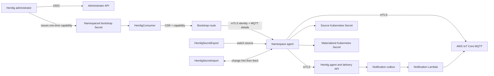

# Hemlig Kubernetes controller plan

## Purpose and release target

This plan turns the existing @hemlig/kubernetes-controller prototype into a
safe, operable open-source Kubernetes integration. It remains a TypeScript,
Node 24, Yarn Berry workspace in this monorepo and consumes only
@hemlig/client. It neither imports Lambda implementation modules nor creates a
parallel AWS deployment.

The controller has two deliberately one-way functions:

- **Import:** an mTLS-authorized, path-scoped namespace agent reads an
  already-granted Hemlig payload and materializes a Kubernetes Secret.
- **Export:** that same namespace agent writes a Kubernetes Secret to its
  permitted Hemlig keyspace. It cannot alter another namespace's keyspace,
  consumer grants, or organizational boundary.

There is no bidirectional resource. A Kubernetes Secret must be either an
import target or an export source, never both. This prevents the controller
from treating its own materialized output as a new remote payload.

The current v1alpha1 controller proves basic pull/push behavior, conditional
consumer reads, and target ownership. It does not yet have bootstrap
capabilities, path-scoped agent authorization, automatic enrollment, watches,
leader election, MQTT notifications, or a Helm chart. The target is a
documented v1beta1 API and a 0.2.0 controller release. v1alpha1 remains served
during one migration release but is not extended further.

## Fixed decisions

| Decision                | Chosen design                                                                                                                                       | Why                                                                                                                              |
| ----------------------- | --------------------------------------------------------------------------------------------------------------------------------------------------- | -------------------------------------------------------------------------------------------------------------------------------- |
| Node version            | Node 24 everywhere: engine constraints, controller image, Lambda runtime, and esbuild target                                                        | A single supported runtime avoids development, container, and Lambda drift.                                                      |
| API topology            | A cluster-scoped HemligProvider plus namespaced HemligConsumer, HemligSecretImport, and HemligSecretExport                                          | Separates public endpoint configuration from namespace workloads and supports more than one Hemlig installation per cluster.     |
| Administrator access    | The controller receives no administrator OIDC token, client secret, or token-file path                                                              | A namespace controller must not hold a credential able to manage every Hemlig secret.                                            |
| Bootstrap               | An administrator creates a one-time opaque bootstrap capability for an AgentGrant; the controller redeems it once with a locally generated CSR      | The capability can activate one pre-scoped identity only. It cannot browse, read, write, or manage arbitrary secrets.            |
| Namespace authorization | Each AgentGrant binds consumer identity, environment, read prefixes, write prefixes, and capabilities; Hemlig enforces it before payload read/write | Kubernetes namespaces and RBAC alone cannot constrain a remote credential.                                                       |
| Identity                | One mTLS consumer identity per HemligConsumer, normally per namespace and environment                                                               | An ACL grant is least-privilege and does not let one namespace read another namespace's grants.                                  |
| Enrollment              | The controller generates a 3072-bit RSA key and CSR, Hemlig signs it, registers it for MQTT, and the controller writes a kubernetes.io/tls Secret   | The private key is generated and retained in the cluster; it is never sent to Hemlig or placed in CR status.                     |
| Import source of truth  | Hemlig consumer API plus the current-access snapshot                                                                                                | ACL revocation is a security event, so the controller can remove previously materialized targets.                                |
| Export source of truth  | The referenced Kubernetes Secret                                                                                                                    | Kubernetes data is authoritative for an export; remote drift is reconciled back to it.                                           |
| Target writes           | Full replacement only on an exact import-owner marker                                                                                               | No merge behavior, clobbering, or ownership takeover of a user-owned Secret.                                                     |
| Delete behavior         | A remote revocation always deletes the exact managed target; CR deletion retains it by default and supports explicit Delete                         | Revocation must remove plaintext promptly. Removing a CR is an administrative hand-off, not proof that data should be destroyed. |
| Change detection        | Kubernetes watches immediately enqueue exports; AWS IoT Core MQTT notifications immediately enqueue imports                                         | Both directions converge in seconds while periodic snapshots remain the correctness backstop.                                    |
| Deployment              | The reusable Hemlig CDK construct owns AWS resources, IAM, stream mappings, alarms, and IoT policy; the chart owns Kubernetes resources             | Installers provision one reviewed topology instead of reimplementing AWS security policy per cluster.                            |
| Packaging               | OCI image, Helm chart, raw generated CRDs, and Kind plus MiniStack tests                                                                            | A cluster operator should be installable without depending on the AWS/CDK consumer repository.                                   |

## Architecture and trust boundaries



The platform team creates a HemligProvider. It contains public, non-secret
endpoint configuration and the namespace selector allowed to use it. Namespace
administrators create consumer, import, and export resources only in a matching
namespace.

An administrator creates an AgentGrant in Hemlig. The grant is the durable
remote policy record: it fixes a consumer ID, environment, read/write path
prefixes, and capabilities. The administrator then mints a short-lived,
single-use bootstrap capability for that grant and places the returned opaque
value in a Secret in the intended namespace. That is the only secret the
controller needs before enrollment.

The controller redeems the capability with a newly generated CSR. Hemlig
atomically consumes the capability, activates the client identity, registers
that client certificate and locked-down thing policy in AWS IoT Core, and
returns only public connection details plus the client leaf. All later reads,
writes, snapshots, MQTT connections, and leaf rotations use mTLS. The bootstrap
capability is useless after redemption and must never be used as a general
administrator credential.

Kubernetes RBAC remains essential. Only trusted roles may read the bootstrap
Secret or create these CRs. The provider selector prevents accidental use from
another namespace; the remote AgentGrant enforces the actual keyspace boundary
even if a controller receives a request for another secret ID.

## Node 24 baseline

Node 24 is the project-wide floor:

- Every workspace and root package declares engines.node as 24.x.
- The Kubernetes controller Docker build and runtime images use node:24-alpine.
- Every CDK Lambda uses nodejs24.x and bundles with a node24 target.
- CI, release images, local tooling, MiniStack scripts, and documentation use
  the same Node 24 baseline.

AWS lists nodejs24.x as the Node 24 Lambda runtime, and current CDK exposes
NODEJS_24_X. See the [AWS Lambda Node.js runtime
reference](https://docs.aws.amazon.com/lambda/latest/dg/lambda-nodejs.html) and
[CDK Runtime reference](https://docs.aws.amazon.com/cdk/api/v2/docs/aws-cdk-lib.aws_lambda.Runtime.html).

## v1beta1 resource contract

All namespaced references are same-namespace. IDs use Hemlig's existing
lowercase secret/consumer grammar. URLs must be HTTPS origins without query or
fragment. CEL validation handles syntax and defaults; cross-resource checks are
reported through conditions.

### HemligProvider (cluster scoped)

```yaml
apiVersion: hemlig.io/v1beta1
kind: HemligProvider
metadata:
  name: production
spec:
  bootstrapUrl: https://admin.hml.example.net
  apiUrl: https://api.hml.example.net
  allowedNamespaces:
    matchLabels:
      hemlig.io/provider-production: "true"
```

This resource contains no credentials, AWS identity, or bootstrap capability.
Its Ready condition means only that the resource is syntactically valid and has
observed generation; failed remote authentication is reported on the resource
that attempts it.

### HemligConsumer (namespaced)

```yaml
apiVersion: hemlig.io/v1beta1
kind: HemligConsumer
metadata:
  name: payments-prod
  namespace: payments
spec:
  providerRef: production
  bootstrapTokenRef:
    name: payments-prod-bootstrap
    key: token
  identity:
    secretName: hemlig-payments-client
    rotateBefore: 720h
```

The desired resource never declares its own consumer ID, environment, paths, or
capabilities. The bootstrap capability is the authority for those values; the
redemption response supplies them and the controller verifies its provider and
namespace expectation before persisting safe status.

A successful enrollment in the current controller:

1. Reads the opaque token from the same namespace without logging it.
2. Generates a 3072-bit RSA private key and signed CSR in process.
3. Creates an exact-owned pending identity Secret containing the local private
   key and public CSR. A retry therefore submits the exact same CSR; the token
   is never exposed through status or logs.
4. Redeems the capability. Hemlig consumes it atomically and returns the leaf,
   grant ID, consumer ID, environment, and allowed prefixes.
5. Atomically creates a kubernetes.io/tls Secret containing tls.crt and tls.key
   with exact consumer-owner, provider, grant, and fingerprint annotations.
6. Verifies `GET /v1/agent/config` using that leaf, obtains the exact MQTT
   endpoint/topic/client ID, and connects before reporting IdentityReady.

The controller leaves the consumed bootstrap Secret unchanged because it cannot
safely modify a user-owned Secret. The server-side token record is already
consumed, so retaining it cannot grant access.

A restart uses an exact-owned TLS Secret. A missing or foreign identity Secret
is an IdentityOwnershipConflict condition; the controller never silently creates
a second consumer or key. Leaf rotation is retained as a v1beta completion item:
the API/identity overlap behavior is specified below, but it is not advertised
as complete until the agent rotation route and IoT cleanup ship together.

Manual enrollment supports operators that create their own identity Secret. It
still needs an administrator-created AgentGrant, and the controller verifies
agent configuration through mTLS before use.

### HemligSecretImport (namespaced)

```yaml
apiVersion: hemlig.io/v1beta1
kind: HemligSecretImport
metadata:
  name: payments-api
  namespace: payments
spec:
  consumerRef: payments-prod
  secretId: payments-api
  target:
    name: payments-api
    type: Opaque
  deletionPolicy: Retain
```

consumerRef, secretId, and target.name are immutable. The target defaults to
the CR name and must be in the CR namespace. On a successful read the
controller writes only data, type, fixed hemlig.io management labels, and fixed
ownership/version/checksum annotations. It does not propagate remote
organizational tags, paths, ACLs, or arbitrary Kubernetes metadata.

The target must either not exist or have both hemlig.io/managed-by: import and
the exact hemlig.io/import-owner: namespace/resource-name marker. A foreign,
modified, or immutable target is a hard TargetOwnershipConflict condition. The
controller never merges individual data keys. target.type may change; the object
is fully replaced with its current resourceVersion.

A remote secret.revoked notification, an authenticated 403, or an authenticated
404 deletes only an exact-owned target and reports AccessRevoked or
RemoteNotFound. Transport and 5xx failures never delete a target. On deletion
of the import CR, Retain removes only controller ownership of reconciliation;
explicit Delete installs a finalizer and removes an exact-owned target. Neither
case can delete a Hemlig secret because the public API intentionally has no
delete operation.

### HemligSecretExport (namespaced)

```yaml
apiVersion: hemlig.io/v1beta1
kind: HemligSecretExport
metadata:
  name: payments-api-source
  namespace: payments
spec:
  consumerRef: payments-prod
  secretId: payments-api
  source:
    name: payments-api-source
  metadata:
    description: Payments API credentials
    path: payments/production
    tags:
      owner: payments
      system: billing
  adoptionPolicy: CreateOnly
```

The source must exist in the same namespace. The controller serializes exactly
its persisted data map as Hemlig base64 entries; it does not consume stringData,
synthesize keys, or include source labels, annotations, or Secret type. It
rejects a source carrying any Hemlig import-management marker, which prevents
feedback loops even if a user tries to export an import target.

The export has no environment or ACL field. Hemlig derives the environment from
the mTLS AgentGrant and requires metadata.path to fall beneath one of that
grant's write prefixes. On first creation Hemlig adds read access for the same
consumer automatically. The namespace agent cannot grant a second consumer,
remove a grant, or edit an ACL; administrators retain those operations through
the administrator API and Pulumi provider.

CreateOnly is the default: an existing remote secret causes RemoteAlreadyExists
unless this CR previously created it. The controller reserves the Hemlig tags
managed-by: hemlig-kubernetes-controller and controller-owner:
provider/namespace/resource-uid. Desired metadata always adds those values and
rejects an attempt to set either tag. An existing secret is managed only when
both tags match the current CR; Adopt is the explicit operation that sets them
before any payload write. This prevents a newly applied CR with a typo from
silently overwriting a manually managed or Pulumi-managed secret. A CR deletion
always orphans the remote secret and source Secret; Hemlig has no delete
operation.

The source, consumerRef, and secret ID are immutable. Metadata and source data
remain declarative. The reconciler fetches agent-visible control state only,
creates remote control state if absent, applies metadata only within scope, then
writes a payload only when the canonical source checksum or remote payload
version differs. A deterministic idempotency key based on CR UID, generation,
operation, and checksum makes a retry after a lost response safe. An ETag
conflict refetches control state and retries once; a second conflict becomes
RemoteConflict for the next work-queue attempt.

## AgentGrant and bootstrap API

AgentGrant is a Hemlig administrator API resource, not a Kubernetes CR. This
keeps remote policy approval with the people and tools that administer Hemlig.

```json
{
  "consumerId": "prod-payments",
  "environment": "prod",
  "capabilities": ["read", "write"],
  "readPathPrefixes": ["payments/production"],
  "writePathPrefixes": ["payments/production"],
  "displayName": "payments namespace in prod cluster"
}
```

Path authorization is segment-aware: a prefix matches the exact path or a path
starting with that prefix followed by a slash. Empty/root prefixes are rejected.
An mTLS agent may read only when its AgentGrant has read scope for the current
secret metadata path and the secret ACL grants its consumer read. It may write
only when its AgentGrant has write scope for the existing or new metadata path.
A secret with no canonical path is never agent-readable or agent-writable.

Administrators create/update AgentGrants with ETags and issue bootstrap
capabilities from them. The returned token is a cryptographically random,
opaque 256-bit value, shown once, hash-stored, tenant-bound, and capped at
thirty minutes. It has one action: redeeming a CSR for that grant. Hemlig
consumes it atomically on successful redemption, or it expires; it cannot be
refreshed, used to alter a grant, or used as an access token.

The CDK stack adds a POST bootstrap redemption route on the administrator API
domain before the JWT-protected default route:

```text
POST /v1/bootstrap/redeem
Authorization: Bootstrap hmlb_opaque-capability
body: { apiCertificateSigningRequestPem }
```

The route is not OIDC or mTLS authenticated because it establishes the first
mTLS identity. Its handler accepts no desired consumer ID, environment, path,
namespace, ACL, or endpoint override from the caller; all authority comes from
the stored AgentGrant. API Gateway access logs remain sanitized, and the handler
never logs authorization headers, CSR text, or response certificates. The route
has strict request-size validation, throttle controls, single-use replay
protection, and safe failure auditing.

After redemption, the controller uses these mTLS agent routes:

| Route                                  | Capability | Controller use                                                         |
| -------------------------------------- | ---------- | ---------------------------------------------------------------------- |
| GET /v1/changes                        | read       | Rebuild current access snapshot after connect and on scheduled resync. |
| GET /v1/secrets/secretId               | read       | Conditional pull with If-None-Match.                                   |
| GET /v1/agent/config                   | read       | Validate grant/scope and obtain public MQTT connection metadata.       |
| POST /v1/agent/secrets                 | write      | Create a path-scoped secret with caller's initial read grant.          |
| PUT /v1/agent/secrets/secretId         | write      | Update allowed metadata with ETag.                                     |
| PUT /v1/agent/secrets/secretId/payload | write      | Replace payload with ETag and idempotency.                             |
| POST /v1/agent/identities/rotate       | read       | Rotate only caller's mTLS/MQTT leaf.                                   |

The namespace agent never receives administrator routes, plaintext from the
administrator payload route, another consumer's grant state, or an operation
that can change ACLs.

## Immediate change detection

### Kubernetes to Hemlig

The controller watches source Secret objects. A persisted-data change enqueues
every matching HemligSecretExport immediately, with a 250 ms debounce to
coalesce a multi-key apply. The leader reads the source, calculates a canonical
SHA-256 over sorted base64 data entries, and invokes the mTLS agent write route.

The write remains ETag and idempotency protected. A successful status stores
source resource version, source checksum, control version, and payload version.
If the process dies after Hemlig accepts a write but before status is saved, the
deterministic idempotency key lets the next reconciliation retrieve the first
result without creating another revision.

### Hemlig to Kubernetes

Every control/payload mutation writes one or two grouped records into a bounded
notification outbox in the same DynamoDB transaction that makes the new control
head current. Access projection rows are updated only when the ACL changes; a
payload-only update therefore does not rewrite every consumer grant. The grouped
records carry the active and revoked recipient sets, so grants and revocations
both notify affected namespace agents asynchronously.

A DynamoDB Stream invokes a dedicated Node 24 notification Lambda within
seconds. It publishes QoS 1, non-retained MQTT messages to the target
consumer's private AWS IoT Core topic:

```json
{
  "schemaVersion": 1,
  "kind": "secret.changed",
  "secretId": "payments-api",
  "controlVersionId": "ctl-01J...",
  "payloadVersionId": "pay-01J..."
}
```

A revocation has kind secret.revoked and no payload version. MQTT never carries
payload data, data keys, ACLs, paths, tokens, certificates, or a presigned URL.
Duplicate, delayed, and missing hints are safe: the controller treats a message
as an untrusted bounded trigger, reads actual mTLS API state, and performs the
same exact-owner check before writing/deleting a Kubernetes Secret.

On MQTT connect and reconnect, the controller first exhausts GET /v1/changes.
A ten-minute full snapshot remains the correctness backstop for broker
disconnections, stream retries, a suspended controller, or an expired MQTT
session. The expected steady state is seconds for a normal mutation and bounded
by the snapshot interval for a failed notification path.

## AWS IoT Core and CDK topology

AWS IoT Core uses the same client leaf that authenticates the namespace agent
to Hemlig's delivery API. It is an additional registration of that public leaf,
not a second private key or KMS key.

During bootstrap redemption and leaf rotation, the enrollment service:

1. Registers the Hemlig-signed leaf as an active AWS IoT client certificate.
2. Creates a stable IoT Thing named from a non-sensitive grant/identity ID and
   attaches the certificate principal.
3. Attaches the CDK-created Hemlig notification policy.
4. Returns the account MQTT endpoint, fixed client ID, and exact subscribe topic
   only after registration succeeds.

The CDK stack creates the shared policy, roles, Lambda functions, DynamoDB
notification table/stream, event source mapping, dead-letter queue, KMS
encryption, log groups, metrics, alarms, and least-privilege IAM policies. The
enrollment service gets only IoT actions to register, activate/deactivate,
attach/detach, and describe managed certificates/things. The notification Lambda
gets iot:Publish solely below the Hemlig notification topic prefix. No
Kubernetes workload receives AWS credentials.

The IoT policy uses an attached Thing and exact connection/client identity. It
permits only Connect with the fixed client ID plus Subscribe and Receive for one
grant notification topic. It grants no Publish, retained messages, wildcard
consumer topics, shadow operations, Jobs, or AWS API access. Broker policy is
defense in depth; Hemlig still validates mTLS identity, AgentGrant paths, and
ACLs before every data operation.

Each client certificate must be registered with AWS IoT to communicate, and AWS
recommends binding client IDs and topics tightly in policies. This design uses
per-leaf registration rather than an AWS-generated private key; the cluster
retains its original key and Hemlig's single KMS-wrapped issuer continues to
sign the public leaf. See [Register a client
certificate](https://docs.aws.amazon.com/iot/latest/developerguide/register-device-cert.html)
and [AWS IoT publish/subscribe policy
examples](https://docs.aws.amazon.com/iot/latest/developerguide/pub-sub-policy.html).

The notification outbox has TTL only after terminal stream delivery. The
publisher retry policy is bounded, and an SQS dead-letter queue plus CloudWatch
alarm exposes a repeatedly failing publish. An outbox failure never rolls back a
valid secret mutation: current snapshots are the guaranteed reconciliation
mechanism.

## Reconciliation runtime

The controller remains TypeScript rather than being rewritten in Go. It uses
the Kubernetes JavaScript client's watch support, a keyed in-memory work queue,
and a coordination.k8s.io/v1 Lease in hemlig-system. Two or more replicas may
run, but only the elected leader performs remote calls, MQTT connections, or
writes managed Secrets. Followers serve health checks and acquire the lease if
the leader fails.

Watch these resources and enqueue only affected keys:

- all four Hemlig CRDs;
- source and target Secret objects in provider-allowed namespaces;
- consumer TLS identity Secrets;
- bootstrap Secrets referenced by pending consumers; and
- namespaces, so selector changes take effect.

The leader maintains one MQTT client per ready HemligConsumer. MQTT reconnect
uses exponential backoff with jitter and creates no more than one session per
consumer. A ten-minute full resync remains the correctness backstop for missed
watch events and MQTT messages. Reconciliation honors Retry-After, limits
concurrent API calls globally and per provider, and does not retain an unbounded
event history or payload cache. The cache contains object keys, resource
versions, checksums, revisions, topic/client IDs, and status only.

For imports, the current snapshot indexes all imports by consumer and secret ID.
A secret.changed hint enqueues the matching import. The reconciler calls GET
/v1/secrets/secretId with If-None-Match only when the local
owner/version/checksum proof is intact. A 304 requires no payload download or
KMS decryption; a missing or changed target forces a full read and repair.

For exports, a Secret watch immediately enqueues the matching resource. The
controller reads agent-visible control metadata but never the administrator
payload route. This keeps the exporter from becoming an extra plaintext reader.

## Status and Kubernetes events

Every resource has observedGeneration, lastTransitionTime, and a standard Ready
condition. Consumers additionally expose IdentityReady and NotificationReady;
imports expose TargetReady; exports expose SourceReady and RemoteReady.
Conditions use stable reasons so alerting does not parse human strings.

| Reason                    | Resource                 | Meaning and operator action                                                                                  |
| ------------------------- | ------------------------ | ------------------------------------------------------------------------------------------------------------ |
| ProviderNotPermitted      | Consumer, import, export | Namespace does not match provider selector. Fix provider selector or namespace label.                        |
| BootstrapTokenUnavailable | Consumer                 | Expected Secret/key is absent. Restore the single-use token before expiry.                                   |
| BootstrapRejected         | Consumer                 | Token expired, was consumed, or does not match provider. Mint a new token for the same grant if appropriate. |
| IdentityOwnershipConflict | Consumer                 | TLS Secret is foreign or altered. Restore exact owned identity or resolve deliberately.                      |
| NotificationUnavailable   | Consumer                 | MQTT certificate/topic/session is not ready. Periodic snapshot still converges.                              |
| TargetOwnershipConflict   | Import                   | Target is foreign, altered, or immutable. Pick another target or deliberately remove it.                     |
| AccessRevoked             | Import                   | Hemlig no longer grants consumer; managed local target was removed.                                          |
| PathNotPermitted          | Import, export           | AgentGrant denies secret path. Change administrator-managed grant, not CR.                                   |
| SourceNotFound            | Export                   | Referenced source Secret does not exist.                                                                     |
| SourceIsImportManaged     | Export                   | A loop was blocked; choose application-owned source.                                                         |
| RemoteAlreadyExists       | Export                   | Set explicit Adopt only after confirming ownership.                                                          |
| RemoteConflict            | Export                   | Another permitted writer changed control state repeatedly. Resolve ownership.                                |

Events are rate-limited and include only resource names, revision IDs,
fingerprints, HTTP class, and safe reason codes. They never contain Secret
values, Kubernetes data keys, bootstrap values, tokens, certificates, CSRs, or
response bodies.

## Security and RBAC

The planned Helm chart creates two profiles:

| Profile | Kubernetes permissions                                                                               | Remote Hemlig permission                                                                |
| ------- | ---------------------------------------------------------------------------------------------------- | --------------------------------------------------------------------------------------- |
| import  | Read exact bootstrap/identity Secrets, manage import targets, read Hemlig CR/status, leases, watches | Bootstrap redemption once, then mTLS read/snapshot/MQTT receive within AgentGrant scope |
| export  | Import profile plus read allowed source Secrets and mTLS agent writes within AgentGrant scope        | Bootstrap redemption once, then mTLS path-scoped export writes                          |

The export profile does not add administrator API access. It differs only by
permission to read source Secret data in permitted Kubernetes namespaces.

The released initial chart is deliberately a broad ClusterRole installation:
the current controller uses all-namespaces resource listing and watches. It does
not pretend that a provider selector or AgentGrant scope narrows its Kubernetes
permissions. It grants no deletecollection, wildcard API groups, or pod exec,
but it does need Secret read/write permission cluster-wide until scoped
discovery and namespaced watches are implemented. The remote AgentGrant remains
the keyspace boundary, while the provider selector limits which namespaces can
enroll against a provider.

The restricted model remains the next RBAC milestone. It will accept an
explicit namespace allowlist or selector, generate namespaced Role and
RoleBinding objects, and change controller list/watch behavior to match. The
controller may get bootstrap Secrets only by exact names referenced from a
pending HemligConsumer; it must not list them.

The controller image runs as non-root with a read-only root filesystem, no
service-account token automount unless the selected installation mechanism needs
it, dropped Linux capabilities, and a seccomp default profile. Network policy
examples allow DNS, Kubernetes API, configured Hemlig endpoints, and AWS IoT
MQTT endpoint only. Pod logs use structured safe fields and reject headers/body
logging.

## Implementation phases

### Phase 0 — Node 24 baseline

- [x] Raise root and workspace engine constraints to Node 24.
- [x] Move controller Docker build/runtime images to Node 24.
- [x] Move CDK Lambda runtime and bundling target to Node 24.
- [ ] Build, lint, test, package, and deploy against Node 24 in CI and an
      isolated AWS acceptance account.

### Phase 1 — remote authorization and shared contracts

- [x] Add AgentGrant and bootstrap-capability administrator routes, immutable
      scope records, opaque hash-stored one-use token records, and agent audit
      operations.
- [x] Add explicit unauthenticated bootstrap redemption route before the JWT
      default route, with tight validation/replay/throttle controls.
- [x] Add mTLS agent config and path-scoped secret create/update/payload routes;
      keep ACL changes administrator-only. Agent self-identity rotation remains
      pending.
- [x] Enforce segment-aware read/write prefixes plus normal consumer ACL checks
      before every path-dependent operation.
- [x] Add current snapshot and bootstrap/agent response types to @hemlig/client.
      The controller must consume canonical contracts rather than duplicate HTTP
      shapes.

### Phase 2 — CDK notification topology

- [x] Add CDK-owned notification outbox table stream, Node 24 publisher
      Lambda, SQS dead-letter queue, logs, alarms, dashboards, and encryption.
- [x] Add CDK-owned AWS IoT policy and narrowly scoped bootstrap enrollment and
      publisher IAM actions. Rotation/recovery cleanup remains pending.
- [x] Register the bootstrap identity with AWS IoT and attach its policy before
      activating the AgentGrant. The generic consumer enrollment flow remains
      available for non-agent consumers.
- [ ] Add IoT deactivation/detachment to leaf revocation and recovery cleanup.
- [x] Write grouped notification outbox records transactionally for the old/new
      ACL union on metadata, ACL, payload, creation, and revocation changes.

### Phase 3 — v1beta1 controller core

- [x] Add v1beta1 schemas for provider, consumer, import, and export; keep
      v1alpha1 served but deprecated.
- [x] Add canonical desired-state comparators for metadata, payloads,
      identifiers, target/identity markers, and deterministic idempotency keys.
- [x] Implement automatic bootstrap enrollment, identity ownership,
      provider namespace authorization, watches, source debounce, MQTT hints, and
      ten-minute snapshot resync.
- [ ] Add Lease leadership, per-provider rate limiting, manual enrollment, and
      leaf rotation before running more than one replica.
- [x] Implement import snapshot/revocation deletion and agent-scoped export
      creation, adoption, ETag, and idempotency semantics.

### Phase 4 — packaging and operability

- [x] Create packages/kubernetes-controller/chart/hemlig-controller with CRDs,
      the current broad RBAC profile, Deployment, hardened security context, values
      schema, Helm lint/render CI, release-tag packaging, and publishing through
      `zyno-io/charts` GitHub Releases.
- [ ] Add the namespace-restricted import/export profiles, ServiceMonitor-
      compatible metrics, PDB, and network-policy examples after the controller can
      scope discovery and watches to those namespaces.
- [ ] Keep rendered standalone manifests under config for non-Helm users.
- [ ] Add healthz, readyz, Prometheus metrics, a hardened Node 24 OCI image,
      SBOM, image provenance, and versioned release notes.
- [ ] Publish migration guidance and a deterministic v1alpha1 to v1beta1
      conversion command; never ask users to edit live status by hand.

### Phase 5 — verification and release

- [ ] Unit-test desired-state builders, owner checks, deterministic idempotency
      keys, path-boundary matcher, bootstrap hash/redeem state machine, conditions,
      retry classification, and no-log guarantee.
- [ ] Test remote services with MiniStack for DynamoDB/S3/KMS workflow, outbox
      transaction, and notification retry behavior. MiniStack cannot emulate API
      Gateway JWT/mTLS, AWS IoT broker authorization, CORS, or deployed Object Lock;
      retain isolated AWS acceptance tests for those boundaries.
- [ ] Test controller reconcilers against fake Kubernetes, Hemlig, and MQTT
      transports for creation, no-op, target/source conflict, path denial, lost
      status write, expired bootstrap, redemption replay, leaf rotation, IoT
      reconnect, and remote revocation.
- [ ] Add Kind integration tests that install chart/CRDs, exercise source
      watches, leader failover, Kubernetes RBAC, MQTT-triggered import, and exact
      Secret ownership/deletion.
- [ ] Add isolated CDK deployment acceptance: create bootstrap capability,
      enroll controller leaf, prove its IoT policy cannot subscribe outside its
      topic, publish a remote change, and observe Kubernetes import convergence
      without waiting for snapshot timer.
- [ ] Gate 0.2.0-rc.1 on Node 24 workspace lint/build/test, MiniStack, Kind,
      CDK synth, chart rendering, AWS acceptance, SBOM, and clean artifact install.

## File-level implementation map

| Area                | Planned files                                                                                                   |
| ------------------- | --------------------------------------------------------------------------------------------------------------- |
| Node baseline       | Root/workspace manifests, controller Dockerfile, cdk/stack.ts, CI images/workflows                              |
| Shared contracts    | packages/client/src/index.ts and tests                                                                          |
| Agent authorization | Domain types/validation, agent/bootstrap services, admin/consumer handlers, repositories, audit adapters        |
| AWS notification    | cdk/stack.ts, CDK tests, notification handler, outbox repository, enrollment/recovery services                  |
| Controller          | packages/kubernetes-controller/src/api/v1beta1.ts, controllers, kubernetes, mqtt, runtime                       |
| CRDs/manifests      | packages/kubernetes-controller/config/crds, config/rbac, config/samples                                         |
| Helm                | packages/kubernetes-controller/chart/hemlig-controller                                                          |
| Tests               | Service/handler/CDK tests, controller unit tests, Kind tests, MiniStack and AWS acceptance scenarios            |
| Documentation       | Controller/chart README, API reference, architecture, threat model, CDK integration, this plan, migration guide |
| CI/release          | Workspace scripts, Node 24 image workflow, chart release, SBOM/provenance workflow                              |

## Acceptance criteria

The controller is ready for a supported v1beta1 release only when all of the
following hold:

- Every workspace, OCI image, CI job, bundler target, and Lambda uses Node 24.
- A bootstrap capability is redeemable exactly once, expires safely, is never
  logged, and cannot invoke administrator operations.
- A HemligConsumer retains a locally generated private key, receives only its
  granted mTLS/MQTT identity, and rotates its leaf without exposing private
  material outside its TLS Secret.
- A namespace agent can neither read nor write a secret whose canonical path is
  outside AgentGrant scope, even when it guesses a valid secret ID.
- An export cannot alter ACLs or cross its write prefix; first creation grants
  only its own consumer read access.
- An import creates and updates only its exact-owned target; remote ACL
  revocation deletes that target; a network failure does not.
- An imported Secret cannot be exported, and a user-owned target cannot be
  overwritten.
- A source Kubernetes Secret change triggers one immediate, idempotent remote
  reconciliation. A Hemlig change produces a payload-free MQTT hint and the
  matching Kubernetes target converges without waiting for snapshot interval.
- A lost MQTT message, stream retry, watch event, leader, or controller process
  does not require manual repair because reconnect and ten-minute snapshots
  converge.
- MQTT policy tests prove a leaf can only connect with its fixed client ID and
  subscribe/receive from one consumer topic; it cannot publish.
- Controller logs, events, status, metrics, MQTT messages, and rendered
  manifests contain no secret payload bytes, values, bootstrap values, bearer
  tokens, private keys, CSRs, or complete client certificates.
- README gives import/export quick start using administrator-created bootstrap,
  path-prefix approval workflow, bootstrap Secret warning, and v1alpha1
  migration path.

## Explicit exclusions

This release does not support arbitrary Secret templates, key filtering,
transforms, cross-namespace target writes, syncing to ConfigMaps, external
Secret-store compatibility CRDs, automatic environment creation, remote secret
deletion, issuer-root rotation, retained MQTT messages, MQTT payload delivery,
or a policy that lets a namespace create/expand its own AgentGrant. Each needs
a separate security and lifecycle design before it is added.
